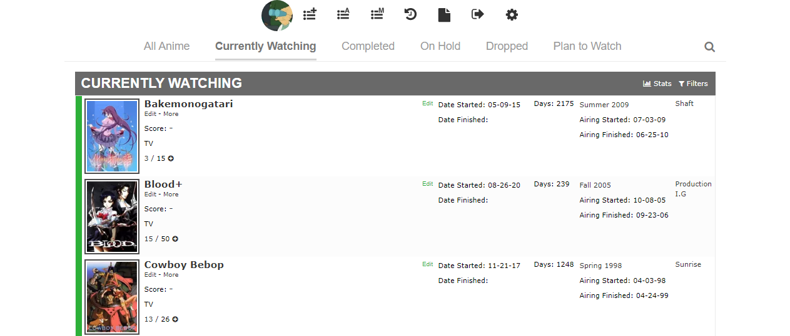
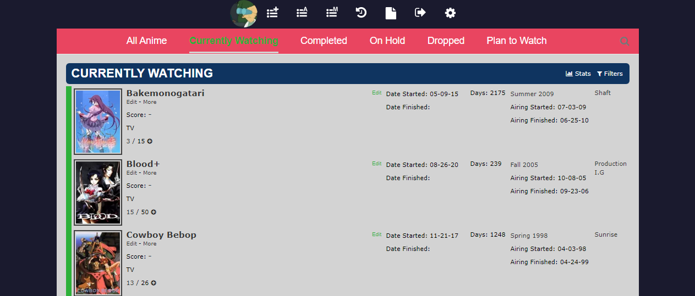
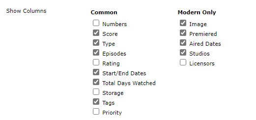
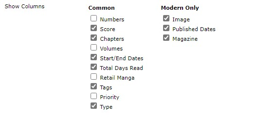
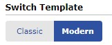
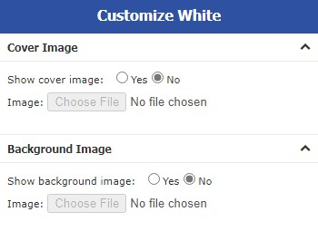

# Minimalist MAL list

This is a minimalist design for MyAnimeList, focused in simplicity.

Feel free to make recommendations and generate a ticket, or fork the project.  

Tested in Edge navigator.

### Project Status: Complete

## Features
- [x] Put the info enlisted with a border.
- [x] Move the account lateral bar in the top of the page.
- [x] Support for anime/manga list.

## Pallete tones 
* Dark theme: https://colorhunt.co/palette/201882
* Clear theme: https://colorhunt.co/palette/1649 

## Image Preview
* [Clear theme](ClearTheme.CSS)

    

* [Dark theme](DarkTheme.CSS)
    
    
    
## Installation
1. Go to **Settings** > **List**
2. Select the next columns: 
    * In anime columns 
    
        
    
    * In manga columns 
    
        
     
3. Go to **Settings** > **List Style Design**

    Switch to **Modern**. 

    
     
4. Select any template, and select **No** 
for the **cover** and the **background**

     
    
5. In the tap Add Custom CSS, add the code in the theme you want.
